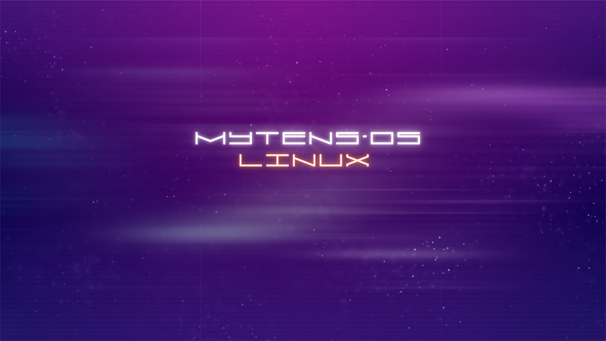

# Mytens-OS-Linux

Seja muito bem-vindo ao melhor sistema Linux!

Um sistema **open source**! 

O sistema conta com uma interface leve e agradável, onde você, usuário, pode personalizá-lo do seu jeito. Ele já vem com o **Python** instalado e algumas aplicações úteis. Este sistema receberá atualizações e novas ferramentas de acordo com o andamento do projeto.

Esta é apenas a versão **1.0 da Mytens**. Aos poucos, o sistema ganhará mais funcionalidades. O sistema já vem com o antivírus **ClamAV** instalado.

Agradeço pela sua visita ao meu perfil. Juntos, vamos construir uma tecnologia inovadora para a indústria e para o mundo!

---

### Agradecimentos

Quero agradecer ao [@JONATHAS-L1M4](https://github.com/JONATHAS-L1M4), que fez parte deste projeto e deu alguns conselhos e orientações e ajudou no desenvolmeento do proejto.

E também ao [Mini-OS](https://github.com/minios-linux/minios-live/wiki?lang=pt) onde disponibilizaram a documentação e apoio, ás imagens deles estão também dentro do sistema.
---

### Download da ISO

🔗 [Baixar ISO do sistema](https://mega.nz/file/d8wVUajB#Sj7s1KBtVQzUmoBxu6IaFhW4TZ5A1SidZ-1CQ1vaoLk)

---

### Imagens do Sistema

---

### Apoie o Projeto

Se você deseja colaborar conosco, deixe sua doação para ajudar na continuação do projeto:

📩 **PayPal:** mytensweb@gmail.com
